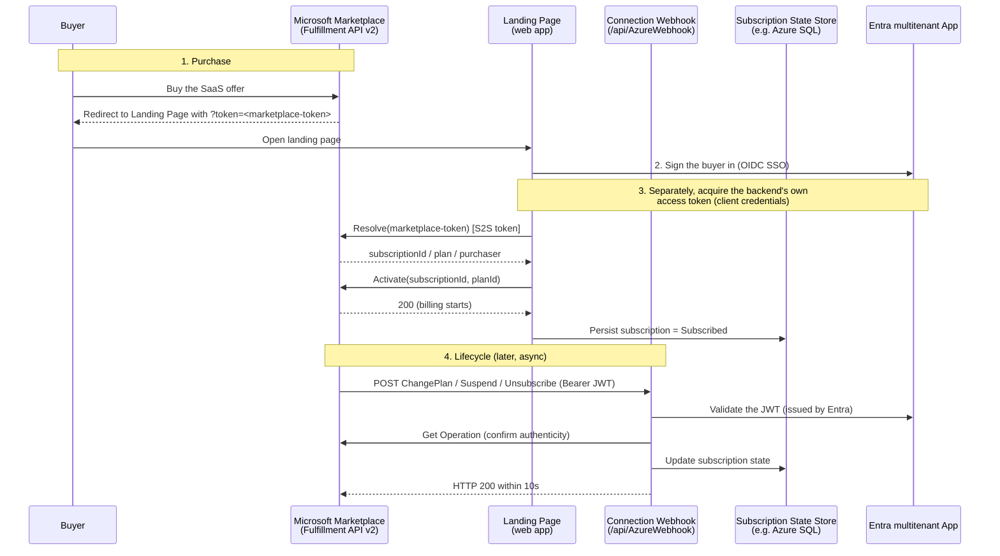

# Backend B: Monetization via Linked SaaS Offer

Microsoft 365 / Copilot agents are free to download and monetized through a **linked SaaS offer**.
This skill provisions that SaaS transaction plane. It is independent of agent type — it runs for a
monetized declarative OR custom engine OR Copilot Studio agent.

> When this runs: `monetize == true`. Requires enrollment in BOTH the Microsoft 365 and Copilot
> program (publish the agent) and the Microsoft Marketplace program (monetize). Never deploys
> without explicit confirmation; the actual Azure provisioning is delegated to `@git-ape`.

> **Preview disclaimer (read first).** This backend depends on Microsoft features that are in
> **preview** (linked SaaS offer monetization for Microsoft 365 Copilot agents, and parts of the
> Marketplace/Partner Center flow). Steps, UI, and eligibility can change without notice. **Do not
> rely on this skill as the single source of truth** — re-verify each step against the linked Microsoft
> Learn docs at run time, and treat this as guidance alongside the official docs, not a replacement.

A **transactable** offer ("Sell through Microsoft") is one in which **Microsoft facilitates the
exchange of money for a software license on the publisher's behalf**, and Microsoft bills using the
pricing model the publisher chose. ([plan-saas-offer], [plans-pricing]) Integrating with the SaaS
Fulfillment APIs is a hard requirement for creating a transactable SaaS offer. ([pc-saas-fulfillment-apis])

These three layers are **physically separated** below because they are different planes. Do not mix
them: a fact from one layer must never be stated as if it belonged to another.

| Layer | What it is | Lives in |
| --- | --- | --- |
| 1. Fulfillment (technical) | Keep subscription state in sync with Microsoft | Code: landing page + connection webhook + Fulfillment/Operations API v2 |
| 2. Pricing / Licensing (commercial) | offer → plan → pricing model; who manages licenses | Partner Center config + publisher entitlement logic |
| 3. Tax / Payment (money) | payout, withholding, W-8 / W-9 | **Partner Center only** — never in code or DB |

## Collect tenant context (just-in-time)

Triage does not collect tenant info. Read `publishing-ledger.json` `tenant.tenantId`; if it's empty
or `<TBD>`, ask the user for the target Entra tenant ID now (needed for the multitenant Entra app
registration and the `@git-ape` deployment target) and write it back to the ledger. Never assume;
never store secrets.

---

## Layer 1 — Fulfillment (technical)

Purpose: **keep the subscription state Microsoft holds in sync with the publisher's state.** Because
the goal is state synchronization, **persisting subscription state is mandatory** — this layer is not
"stateless because it's minimal."

**Canonical components** (use these terms, from the page headings):

1. **Multitenant Microsoft Entra ID app** for landing-page SSO. The landing page must support SSO with
   the multitenant Entra app and allow both work/school and personal Microsoft accounts. ([plan-saas-offer], [pc-saas-fulfillment-life-cycle])
2. **Landing page**: the URL Microsoft opens (with a purchase-identification token) after purchase. The
   publisher exchanges that token via the **Resolve API**, then calls the **Activate API** to start the
   billing cycle. Must be up **24/7**; must not contain `#` or secrets/tokens. ([create-new-saas-offer-technical], [pc-saas-fulfillment-life-cycle])
3. **Connection webhook**: HTTP endpoint Microsoft POSTs asynchronous events to
   (`Subscribe`, `ChangePlan`, `ChangeQuantity`, `Renew`, `Suspend`, `Unsubscribe`, `Reinstate`). ([pc-saas-fulfillment-webhook])
4. **Fulfillment Subscription API v2 + Operations API v2** (v1 is deprecated). These are **only** called
   from the publisher's backend service; service-to-service auth only — never from the web page. ([pc-saas-fulfillment-apis])

**Subscription lifecycle states** the state store must track:
`PendingFulfillmentStart` → `Subscribed` (Active, billing on) → being updated → `Suspended` →
`Unsubscribed`. With **auto activation** on, the subscription skips `PendingFulfillmentStart` and goes
straight to `Subscribed` at purchase (no Resolve/Activate call; a `Subscribe` webhook is sent instead).
The publisher has 30 days to resolve a `PendingFulfillmentStart` asset or it is voided. ([pc-saas-fulfillment-life-cycle], [create-new-saas-offer-plans])

**Webhook hard requirements** (all mandatory):

- Acknowledge every event with **HTTP 200**. ([pc-saas-fulfillment-webhook])
- For `ChangePlan` / `ChangeQuantity`, PATCH the operation status (success/failure) via the Operations
  API **within 10 seconds**; if no reply arrives in that window the change is **auto-accepted as
  Success**. ([pc-saas-fulfillment-webhook], [pc-saas-fulfillment-life-cycle])
- **Validate the Microsoft Entra token (JWT bearer)** from the request header, and call the Get
  Operation API to validate/authorize the payload before acting. ([pc-saas-fulfillment-webhook])
- Endpoint up **24 x 7** (Microsoft retries 500 times over 8 hours, then the operation fails). ([pc-saas-fulfillment-webhook])
- Do not strictly deserialize the payload — Microsoft may extend the schema. ([pc-saas-fulfillment-webhook])

> No pricing, payout, withholding, or tax logic belongs in this layer.

### Architecture at a glance + the 3 tokens (developer view)

A deployed Tier-1 backend (e.g. the SaaS Accelerator) is "a sample that runs" until you can see
*what the moving parts are and which token does what*. The diagram below is the orientation; the
two clarifications under it are the parts developers most often get wrong.



**Clarification 1 — the multitenant Entra app plays THREE roles** (one app, three jobs; conflating
them is the usual source of bugs):
1. **Buyer SSO** on the landing page (OIDC sign-in, any work/school or personal account).
2. **Service-to-service auth** for the backend to call the **Fulfillment/Operations API** (client
   credentials → an Entra access token).
3. **Webhook caller validation** — the JWT Microsoft sends on each webhook call is an Entra token;
   the backend validates it before acting.

**Clarification 2 — there are THREE different tokens; do not confuse them:**

| Token | Who issues it | Who holds/sends it | Purpose |
| --- | --- | --- | --- |
| `marketplace-token` (purchase id token) | Microsoft Marketplace | arrives as `?token=` on the landing page | opaque identifier passed to **Resolve** to look up the subscription |
| Backend **Entra access token** | Microsoft Entra (client credentials) | the backend service | **S2S** auth to call Fulfillment/Operations API (never from the web page) |
| Buyer **SSO token** | Microsoft Entra (OIDC) | the buyer's browser session | authenticates the human on the landing page |

> The landing page and webhook are the only public surfaces; the Fulfillment/Operations API is
> called **only** from the backend with the S2S token. The state store is what makes the webhook's
> job (keep state in sync) possible.

### Verifying Tier-1 fulfillment (A1, free)

You cannot fully exercise Resolve/Activate with a *real* `marketplace-token` without a paid
purchase. Verify at the level the dry-run allows:

- **L1 (reachability / liveness, instant):** the landing page returns HTTP 200; the webhook rejects
  an unauthenticated/invalid POST (e.g. HTTP 400/401) — proving the endpoint is live and its
  validation path is wired.
- **L2 (synthetic end-to-end, free — the real A1 check):** point the official **SaaS API Emulator**
  ([saas-api-emulator]) at the backend to issue a synthetic `marketplace-token` and drive
  Resolve → Activate → webhook, then confirm the **subscription row appears/updates in the state
  store**. No real purchase, no charge.
- **L3 (real purchase, paid, opt-in):** a DEV-offer test purchase yields a real token (cancel within
  72h for a next-month refund). Not required for Tier-1 "done".

### Route (a) environment prerequisites & cost (from a real dry-run)

> **Cost note:** route (a) deploys **always-on billable Azure resources** (App Service Plan B1,
> Azure SQL, Key Vault, plus a VNet) — unlike the free fulfillment-API plumbing, these bill
> continuously while deployed. For a same-day A1 spike that's a few dollars, but a deploy-and-forget
> backend keeps charging. **Tear down the resource group when not in use;** A1 verification does not
> require leaving it running.

Standing up the Accelerator's `deployment/Deploy.ps1` surfaced prerequisites the upstream README
does not list. Confirm these before deploying:

1. **.NET 8 SDK** installed (the script aborts if `dotnet --version` isn't 8.x). On a machine with a
   newer SDK **also** installed, bare `dotnet --version` returns the highest (e.g. `10.x`) and the
   script's `.StartsWith('8.')` check aborts even though 8.x is present. The repo's `global.json` pins
   8.0.x, so **run `Deploy.ps1` from inside the cloned repo** (where `global.json` applies) and confirm
   with `dotnet --list-sdks` that an 8.x SDK is listed.
2. **`dotnet-ef`** global tool (`dotnet tool install --global dotnet-ef`) — used to generate the DB schema.
3. **PowerShell 7.x (pwsh), not Windows PowerShell 5.1.** Under `$ErrorActionPreference='Stop'`, the
   script's az pre-checks (e.g. `az keyvault show` on a not-yet-created RG) raise a terminating
   `NativeCommandError` in 5.1; pwsh 7 tolerates the non-zero exit.
4. **DB schema apply:** the script's `Invoke-Sqlcmd` (SqlServer module) can throw a `TdsParser`
   type-initializer error under pwsh 7 — and even on 8.2.1 the deploy can stop at *"Execute SQL
   schema/data script"* before it publishes the app code. Workaround: apply `script.sql` (emitted
   under `deployment/`) with **go-sqlcmd** using your `az login` context and the
   **`ActiveDirectoryAzCli`** auth method (verified working — do **not** mix with `-G`):
   `sqlcmd -S <prefix>-sql.database.windows.net -d <prefix>AMPSaaSDB --authentication-method=ActiveDirectoryAzCli -i script.sql`.
5. **App Service quota is subscription/region/time-specific** — it is **not** a fixed regional fact.
   Some subscriptions show `Total VMs = 0` for App Service in a given region (in this dry-run, that
   was East US 2 and Japan East), so B1 creation fails there. **Verify your own quota** (e.g.
   `az vm list-usage -l <region>`) and pick a region with capacity rather than assuming any specific
   region works or fails. In this run, West US 3 had capacity.
6. **SQL Server provisioning is also region-gated and time-varying** — `RegionDoesNotAllowProvisioning`
   can occur (in this run, East US and West US 2). **Check current SQL availability for your target
   region** and choose one that allows **both** App Service and SQL. In this run, West US 3 allowed both.
   The SQL server FQDN the script emits follows `<prefix>-sql.database.windows.net` (confirmed).
7. **Clone a release tag, not `main`.** `main` HEAD can carry post-release commits that break
   `Deploy.ps1`; use the latest stable tag: `git clone --branch 8.2.1 --depth 1 <accelerator-repo>`.
8. **`Deploy.ps1` line ~214 uses a retired AzureRM cmdlet.** In an otherwise all-`az`-CLI script it
   calls `Get-AzureRmSqlServer` (AzureRM was retired 2024); with no Az PowerShell module present this
   is a `CommandNotFound` that aborts the run right after *"Starting SaaS Accelerator Deployment"*.
   One-line patch: replace it with
   `$sql_exists = $(az sql server show --name $SQLServerName --resource-group $ResourceGroupForDeployment 2>$null)`.
9. **Entra app-registration is subject to tenant governance.** `Deploy.ps1` registers three Entra apps
   (Fulfillment single-tenant, Admin, and a **multi-tenant** "Landing" app) and resets a client secret.
   Some org tenants enforce policies that **cap secret lifetime** (the script's default request, e.g.
   `--years 2`, may be rejected) and/or **disallow multi-tenant audiences**
   (`AzureADandPersonalMicrosoftAccount`) — leaving the Landing app uncreated and its client id empty.
   **Before deploying, confirm with your tenant admin:** (a) you hold app-registration rights
   (Application Administrator / Global Admin may be required), (b) your allowed secret lifetime, and
   (c) whether multi-tenant audiences are permitted — then adjust the `Deploy.ps1` parameters to match.

### L2 provisioning — exact command sequence (snapshot 2026-07-07)

> **Snapshot — re-verify against upstream before running.** The commands below are a
> point-in-time capture, **cold-start re-validated 2026-07-07** (a from-scratch rebuild following only
> this runbook — which surfaced prereqs 7–9 and the emulator Dockerfile fix below). Treat them as a
> *layer on top of* the upstream official installers, whose base steps and parameter defaults may
> drift: the Accelerator [Installation-Instructions.md][saas-accelerator-install] and the emulator
> [launching.md][saas-emulator-launching] / [integration.md][saas-emulator-integration]. Re-read those
> first; use the sequence here for the parts they don't spell out. All identifiers are placeholders
> (`<prefix>`, `<rg>`, `<region>`, `<admin-upn>`, `<tenant>`, `<sub>`) — never write real values.

Prereqs (above) done and `az login` on the target subscription:

**1. Deploy the Accelerator** (landing + admin portals, App Service Plan, SQL `AMPSaaSDB`, Key Vault,
VNet, and the three Entra apps) via its own installer. Clone the **release tag** (see prereq 7) and
apply the **line-214 patch** (prereq 8) first. From the cloned repo's `deployment/` folder:

```powershell
git clone --branch 8.2.1 --depth 1 https://github.com/Azure/Commercial-Marketplace-SaaS-Accelerator.git
# then apply the prereq-8 one-line patch to deployment/Deploy.ps1 before running:
./Deploy.ps1 `
  -WebAppNamePrefix "<prefix>" `        # ≤21 chars, becomes <prefix>-portal / <prefix>-admin
  -ResourceGroupForDeployment "<rg>" `
  -PublisherAdminUsers "<admin-upn>" `
  -Location "<region>" `                # region that allows BOTH App Service AND SQL (see prereqs 5–6)
  -TenantID "<tenant>" `
  -AzureSubscriptionID "<sub>"
```

**2. Apply the DB schema** if the script's `Invoke-Sqlcmd` step fails (see prereq 4) — use go-sqlcmd
with your `az login` context (the script emits `script.sql` under `deployment/`):

```powershell
sqlcmd -S <prefix>-sql.database.windows.net -d <prefix>AMPSaaSDB `
  --authentication-method=ActiveDirectoryAzCli -i script.sql
```

**3. Build & host the emulator** (image → ACR → ACI, port 80 exposed, capture FQDN). Clone the emulator
repo; its `docker/Dockerfile` (`FROM node:18-alpine3.16`, `ENV PORT=80`) has a
`RUN npm install -g npm` line that pulls **npm@11** (requires node ≥20) and breaks `az acr build`
— **delete that one line** (the bundled npm 9 builds fine), then:

```powershell
az acr create -g <rg> -n <acrname> --sku Basic --admin-enabled true
az acr build -r <acrname> -t marketplace-api-emulator:latest -f docker/Dockerfile .
az container create -g <rg> -n <prefix>-emu `
  --image <acrname>.azurecr.io/marketplace-api-emulator:latest `
  --registry-login-server <acrname>.azurecr.io `
  --registry-username $(az acr credential show -n <acrname> --query username -o tsv) `
  --registry-password $(az acr credential show -n <acrname> --query 'passwords[0].value' -o tsv) `
  --dns-name-label <prefix>emu --ports 80 --os-type Linux --cpu 1 --memory 1 `
  --environment-variables PORT=80 `
    LANDING_PAGE_URL=https://<prefix>emutls.<region>.azurecontainer.io/landing.html
# emulator FQDN → http://<prefix>emu.<region>.azurecontainer.io  (port 80; this is <emulator-FQDN>)
# LANDING_PAGE_URL must be the HTTPS TLS-front FQDN (step 4), not the http emulator FQDN — the
# browser/Accelerator hit the front, not the emulator directly. (Set it up front; the front FQDN
# is deterministic from <prefix>emutls.)
```

**4. Put a TLS front over the emulator** (the Accelerator calls Fulfillment over HTTPS; the emulator
serves HTTP — see the gotcha table). A one-container Caddy ACI is enough. `Caddyfile`:

```text
<prefix>emutls.<region>.azurecontainer.io {
    reverse_proxy http://<prefix>emu.<region>.azurecontainer.io {
        header_up Host <prefix>emu.<region>.azurecontainer.io
    }
}
```

Deploy Caddy as a second ACI via `az container create -g <rg> --file caddy-aci.yaml`, where
`caddy-aci.yaml` mounts the `Caddyfile` as a base64 secret volume (verified working — Caddy
auto-provisions a Let's Encrypt cert, and `https://<prefix>emutls.../landing.html` returns 200):

```yaml
apiVersion: 2019-12-01
location: <region>
name: <prefix>-emutls
properties:
  osType: Linux
  restartPolicy: Always
  ipAddress:
    type: Public
    dnsNameLabel: <prefix>emutls
    ports:
    - { protocol: tcp, port: 80 }
    - { protocol: tcp, port: 443 }
  containers:
  - name: caddy
    properties:
      image: caddy:2-alpine
      resources: { requests: { cpu: 1, memoryInGB: 1.0 } }
      ports:
      - { port: 80 }
      - { port: 443 }
      volumeMounts:
      - { name: caddyfile, mountPath: /etc/caddy }
  volumes:
  - name: caddyfile
    secret:
      Caddyfile: <base64 of the Caddyfile above>
```

The HTTPS front `https://<prefix>emutls.<region>.azurecontainer.io` is what G1 points the portal at.

**5. Disable webhook JWT validation + restart** (the 401 gotcha — emulator-only), then restart both apps:

```powershell
sqlcmd -S <prefix>-sql.database.windows.net -d <prefix>AMPSaaSDB `
  --authentication-method=ActiveDirectoryAzCli `
  -Q "UPDATE ApplicationConfiguration SET Value='false' WHERE Name='ValidateWebhookJwtToken'"
az webapp restart -g <rg> -n <prefix>-portal
az webapp restart -g <rg> -n <prefix>-admin
```

**6. Prep a reset proc** so the synthetic run can be re-driven cleanly (optional but handy for demos):

```sql
CREATE OR ALTER PROCEDURE dbo.DataCleanup AS
BEGIN
  SET NOCOUNT ON;
  DELETE FROM SubscriptionAuditLogs; DELETE FROM Subscriptions;
  DELETE FROM Users; DELETE FROM Plans; DELETE FROM Offers;
END
```

The four **UI wiring gates** (portal `FulFillmentAPIBaseURL` = `<emulator-TLS-FQDN>/api`; emulator
Webhook + Landing Page URLs = the portal domain; synthetic purchase; webhook op) are in the
done-checklist below and detailed in [integration.md][saas-emulator-integration].

### L2 emulator run — operational gotchas (from a real synthetic E2E)

The prerequisites above get the Accelerator *deployed*; the items below are what surfaced while
actually driving Resolve → Activate → **webhook → state-store sync** with the emulator. Each row is
**symptom → fix (test) → why → production answer**. All values are anonymized — use placeholders
(`NAME-portal`, `NAME-admin`, `<RG>`, `<region>`); never write real tenant/subscription/resource IDs.

| Symptom | Fix (emulator run only) | Why | Production answer |
| --- | --- | --- | --- |
| **Webhook returns HTTP 401; the state store never syncs**, even though the emulator's own UI shows the change succeeded | Set `ValidateWebhookJwtToken=false` in the Accelerator's `ApplicationConfiguration` table, then **restart the portal app** | The Accelerator's webhook JWT validator requires the caller token's `appid`/`azp` to equal the fixed Microsoft Marketplace app id `20e940b3-4c77-4b0b-9a53-9e16a1b010a7`; the emulator cannot mint a token with that claim, so every emulator-fired webhook is rejected. ([pc-saas-fulfillment-webhook]) | **Keep `true`.** Real Microsoft-sent webhooks satisfy the check; this is an emulator-only concession. Filed upstream as [saas-emulator-issue-68]. |
| Intermittent HTTP 500 after it was working (Key Vault `ForbiddenByConnection` / SQL firewall block) | Re-enable public network access on **both** Key Vault and SQL before each operation batch | A subscription-level governance policy periodically re-disables `publicNetworkAccess` | Use **private endpoints** for KV and SQL; do not depend on public network access |
| App settings hold literal secrets (connection string, client secret) | For the throwaway spike these were set as **direct literal values** to sidestep KV-networking flakiness | Fastest way to unblock a disposable test env | Use **Key Vault references** for the connection string and client secret |
| Admin/publisher portal (`NAME-admin`) returns 500 | Apply the **same** non-code fixes as the landing page (`NAME-portal`): literal connection string + client secret, repoint the fulfillment base URL at the emulator, restart — **no code rebuild** | AdminSite shares the same config surface and its sign-in authority already targets the specific tenant | Same as landing page (KV refs + private endpoints) |
| Emulator serves HTTP but the Accelerator calls out over HTTPS | Put a small TLS reverse-proxy in front of the emulator and point `SaaSApiConfiguration__FulFillmentAPIBaseURL` at the HTTPS front | The Accelerator's outbound Fulfillment calls expect a TLS endpoint | N/A — production talks to the real Microsoft Fulfillment API over HTTPS |
| A webhook action is rejected as invalid | Fire only actions valid for the current state: `Suspend`/`Renew` require `Subscribed`; `Reinstate` requires `Suspended`; `Unsubscribe` requires `Subscribed` or `Suspended` | The emulator enforces the same lifecycle state-machine | Same state-machine applies in production ([pc-saas-fulfillment-life-cycle]) |

**L2 "done" checklist** (what proves the synthetic E2E, beyond mere liveness):

1. The state-store subscription row walks the lifecycle — `→ PendingFulfillmentStart → …(Activate)… → Subscribed` — then a **webhook-driven** transition (e.g. `Subscribed → Unsubscribed`).
2. The **emulator container log shows `Webhook response 200`** for that action. A `401` there means JWT validation is still on (see row 1) and the store did **not** sync.
3. A new **audit-log row** records the webhook-driven transition — this is the inbound half (Microsoft→publisher state sync), distinct from the outbound Activate.

> **Security note:** the literal-secret, public-access, and `ValidateWebhookJwtToken=false` states above
> are **deliberate throwaway-test conveniences**. Never carry them into a persistent or internet-exposed
> deployment — the *production answer* column is the target state. Tear the resource group down once the
> L2 check is complete.


---

## Layer 2 — Pricing / Licensing (commercial)

The commercial hierarchy is **offer → plan → pricing model**. A **plan** (sometimes called a **SKU**)
defines scope, markets, and pricing; an offer must have at least one plan. ([plans-pricing], [create-new-saas-offer-plans])

**Pricing model — exactly two choices for SaaS:** **flat rate** or **per user**.
([plan-saas-offer], [plans-pricing])

- **One offer = one pricing model.** All plans in an offer share the same model; you cannot mix a flat
  rate plan and a per-user plan in the same offer. The choice is locked after publishing. ([plans-pricing], [saas-metered-billing])
- **Metering is not a third model.** It is an **optional extension of the flat rate model only**:
  flat-rate plans may add custom dimensions (e.g., emails, bandwidth) billed on consumption above the
  base fee. **Metering is unavailable on the per-user model.** ([plans-pricing], [saas-metered-billing])

**License management** is a **separate axis** from pricing (do not conflate with tax):

- **Publisher-managed** entitlement: the publisher maps each subscription to user access in its own
  store/logic.
- **Microsoft License Management Service**: the publisher integrates with the **usageRights Graph API**
  to verify customer eligibility so customers manage licenses in the Microsoft Admin Center.
  ([plan-saas-offer], [isv-app-license-saas])

> No payout, withholding, or W-8/W-9 logic belongs in this layer. License management ≠ tax.

---

## Layer 3 — Tax / Payment (money)

This layer is **Partner Center configuration and Microsoft's financial process only**. It must **never
appear in code or in the database** this skill provisions.

- Microsoft Marketplace runs an **agency model**: the publisher sets prices, Microsoft bills the
  customer, pays the publisher, and withholds an agency fee. ([plans-pricing])
- Payouts are generally **monthly**; payment is issued by **Microsoft Corporation (a US entity)**. ([payout-policy-details])
- To determine any applicable **withholding**, the publisher submits **Forms W-8 / W-9** in Partner
  Center. ([payout-policy-details])
- Markets can be filtered to **"Tax Remitted"** countries/regions, where Microsoft remits sales/use tax
  on the publisher's behalf — this is a Partner Center market setting, not application logic. ([plans-pricing], [create-new-saas-offer-plans])

> This skill writes no payout, tax, or withholding values to the ledger, code, or DB.

---

## Implementation tiers (what the backend builds)

Tiers are additive. They live in Layers 1–2; Layer 3 is never code.

- **Tier 1 — Fulfillment minimum (state table required).** Entra multitenant app + landing page +
  connection webhook + Subscription/Operations API v2, backed by a **subscription-state store** that
  tracks the lifecycle states above. Satisfies the transactable-offer requirement. ([pc-saas-fulfillment-apis], [pc-saas-fulfillment-life-cycle], [create-new-saas-offer-technical])
- **Tier 2 — Entitlement.** Publisher-managed mapping of subscription → user access, or integration
  with the Microsoft License Management Service via the usageRights Graph API. ([plan-saas-offer], [isv-app-license-saas])
- **Tier 3 — Metering (flat rate only).** Emit usage events via the Marketplace metering service API
  for custom dimensions. **Constraint: flat-rate plans only; never attach metering to a per-user plan.**
  Only emit usage above the base fee; one event per hour per dimension per resource (the SaaS
  `subscriptionId`); TLS 1.2; `api-version=2018-08-31`. ([saas-metered-billing], [marketplace-metering-service-apis])
  > **Not demoable via the SaaS API Emulator.** The emulator implements only the Fulfillment APIs v2
  > (landing / activate / update / suspend-reinstate / webhook); it has **no** metering / usage-event
  > support. The Marketplace Metering Service API requires a real subscription and posts real usage to
  > Microsoft's live metering endpoint. Keep metering **conceptual** at L2; a live metering demo is a
  > separate L3 (real purchase) task, implemented against the real endpoint.

WAF 5-pillar baseline still applies to the deployed backend: tenant isolation, IaC, Key Vault, CI/CD,
encryption, compliance.

## Build & delegation (two routes — Accelerator recommended for Tier-1)

There are two ways to stand up the Tier-1 backend. **Route (a) is the recommended shortest path;**
route (b) is the hand-rolled, fully self-contained path. Pick one.

### Route (a) — Microsoft SaaS Accelerator (recommended for Tier-1)

Deploy the **Microsoft Commercial Marketplace SaaS Accelerator**
([`Azure/Commercial-Marketplace-SaaS-Accelerator`](https://github.com/Azure/Commercial-Marketplace-SaaS-Accelerator),
MIT, community-supported) using **its own official installer** (`deployment/Deploy.ps1`). One
install lays down the full Tier-1 plane: **landing page + connection webhook + subscription state
DB (Azure SQL) + an admin/publisher portal**, and it registers the multitenant Entra app for you —
no Partner Center offer is required to stand it up. This is the **fastest route to a working
Tier-1**. ([saas-accelerator])

- Targets **.NET 8 (LTS, EOL 2026-11-10)**; leave framework upgrades to upstream. **If you run
  this in production past 2026-11, confirm the Accelerator has moved to .NET 10 LTS** before
  relying on it. (.NET 8 here is an intentional LTS choice, not stale code.) ([dotnet-lifecycle])
- `@git-ape` onboarding is **optional** for route (a) (the Accelerator ships its own installer).
  Note the trade-off: bypassing `@git-ape` skips its **security gate / cost estimate / audit
  trail** — acceptable for an A1 spike, but reconsider routing the deploy through `@git-ape` (or
  an equivalent governance gate) for production.
- A1 (free) verification: you can exercise Resolve / Activate / webhook **without a real purchase
  token** using the official **[Commercial-Marketplace-SaaS-API-Emulator](https://github.com/microsoft/Commercial-Marketplace-SaaS-API-Emulator)**
  (Fulfillment API emulator). ([saas-api-emulator])

### Route (b) — hand-rolled IaC, deployed via @git-ape (self-contained)

Provision the Layer 1–2 artifacts yourself, grounded in the Microsoft Learn references below.
Author the infrastructure-as-code and hand the **deployment** to `@git-ape` (security gate, cost
estimate, audit trail). Do not depend on any third-party skill set for the SaaS plumbing.

| Capability | How |
| --- | --- |
| Multitenant SaaS baseline / landing zone | Author IaC (ARM/Bicep); deploy via `@git-ape` |
| SaaS fulfillment landing page + webhook + state store | Implement against the Fulfillment APIs v2 (Layer 1); deploy via `@git-ape` |
| Tenant isolation model | Decide per WAF guidance; encode in IaC |
| IaC deploy (App Service / DB / Key Vault / Entra) | `@git-ape` (security gate, cost estimate, audit) |
| Offer-type / pricing decisions | Use the Partner Center references (Layer 2) |

Either route: this skill owns the decisions and the Partner Center technical-config values; the
Azure deployment is performed by the Accelerator installer (a) or by `@git-ape` (b).

## Shared-resources contract

If `backend-agent-runtime` (A) already ran (custom engine), reuse its
`backend.execution.resourceGroup`, Entra tenant, and Key Vault from the ledger. Do not create
duplicates. Record everything under `backend.monetization`.

## Outputs / ledger updates

- `backend.monetization`: `{ status, resourceGroup, fulfillmentEndpoint, entraAppId }`.
- The Partner Center SaaS offer technical configuration values (landing page URL, webhook URL,
  Entra app/tenant IDs) for the human to paste into the SaaS offer.
- `programs.microsoftMarketplace = "enrolled"` once confirmed.
- `audit[]`: provisioning entries.

## Boundary

This skill prepares the SaaS backend and its Partner Center technical-config values. Creating and
submitting the SaaS offer (and linking it to the agent) is done by the human in Partner Center.

> Preview note (2026-04): The **Product Ingestion API** (`https://graph.microsoft.com/rp/product-ingestion`)
> can configure and publish SaaS offers and the SaaS↔agent link declaratively, and now also covers the
> "AI Apps and Agents" category (in preview). However, publishing a change still goes through the
> standard validation/certification flow and a manual **Go-live**, so API value is essentially
> configure/draft automation — the review and go-live remain manual. This skill therefore keeps the
> portal flow as the primary path; treat API automation as an emerging preview option, not a substitute
> for certification.

## References (all fetched 2026-06-19, HTTP 200)

Primary sources for every claim above. The `[token]` matches the inline citations in the body.

Concepts / terminology:
- [plan-saas-offer]: https://learn.microsoft.com/en-us/partner-center/marketplace-offers/plan-saas-offer
- [plans-pricing]: https://learn.microsoft.com/en-us/partner-center/marketplace-offers/plans-pricing

Fulfillment layer:
- [pc-saas-fulfillment-apis]: https://learn.microsoft.com/en-us/partner-center/marketplace-offers/pc-saas-fulfillment-apis
- [pc-saas-fulfillment-life-cycle]: https://learn.microsoft.com/en-us/partner-center/marketplace-offers/pc-saas-fulfillment-life-cycle
- [pc-saas-fulfillment-webhook]: https://learn.microsoft.com/en-us/partner-center/marketplace-offers/pc-saas-fulfillment-webhook
- [create-new-saas-offer-technical]: https://learn.microsoft.com/en-us/partner-center/marketplace-offers/create-new-saas-offer-technical

Pricing / metering layer:
- [create-new-saas-offer-plans]: https://learn.microsoft.com/en-us/partner-center/marketplace-offers/create-new-saas-offer-plans
- [isv-app-license-saas]: https://learn.microsoft.com/en-us/partner-center/marketplace-offers/isv-app-license-saas
- [saas-metered-billing]: https://learn.microsoft.com/en-us/partner-center/marketplace-offers/saas-metered-billing
- [marketplace-metering-service-apis]: https://learn.microsoft.com/en-us/partner-center/marketplace-offers/marketplace-metering-service-apis

Tax / payment layer:
- [payout-policy-details]: https://learn.microsoft.com/en-us/partner-center/marketplace-offers/payout-policy-details

Delegated Azure deployment (not a Microsoft Learn source):
- Git-Ape: https://azure.github.io/git-ape/

Tier-1 build route (a) — Accelerator (not Microsoft Learn sources):
- [saas-accelerator]: https://github.com/Azure/Commercial-Marketplace-SaaS-Accelerator (MIT; latest release 8.2.1; last updated 2026-06-10; targets .NET 8)
- [saas-accelerator-install]: https://github.com/Azure/Commercial-Marketplace-SaaS-Accelerator/blob/main/docs/Installation-Instructions.md (fetched 2026-07-07, HTTP 200 — Deploy.ps1 base steps)
- [saas-api-emulator]: https://github.com/microsoft/Commercial-Marketplace-SaaS-API-Emulator (Fulfillment API emulator for token-free A1 testing)
- [saas-emulator-launching]: https://github.com/microsoft/Commercial-Marketplace-SaaS-API-Emulator/blob/main/docs/launching.md (fetched 2026-07-07, HTTP 200 — build image, host on ACI, port 80, LANDING_PAGE_URL)
- [saas-emulator-integration]: https://github.com/microsoft/Commercial-Marketplace-SaaS-API-Emulator/blob/main/docs/integration.md (fetched 2026-07-07, HTTP 200 — wiring emulator ↔ Accelerator)
- [saas-emulator-issue-68]: https://github.com/microsoft/Commercial-Marketplace-SaaS-API-Emulator/issues/68 (fetched 2026-07-04, HTTP 200 — upstream doc-gap report: emulator webhooks require the Accelerator's `ValidateWebhookJwtToken=false`)

Framework lifecycle:
- [dotnet-lifecycle]: https://learn.microsoft.com/en-us/lifecycle/products/microsoft-net-and-net-core (.NET 8 LTS, EOL 2026-11-10; .NET 10 LTS to 2028-11-14)

Not re-verified this session (do not cite as confirmed until fetched):
- monetize-addins-through-microsoft-commercial-marketplace, artificial-intelligence-app-agent-publish-release, startups/build/ai/agents/intro-marketplace-agents — 未検証.
