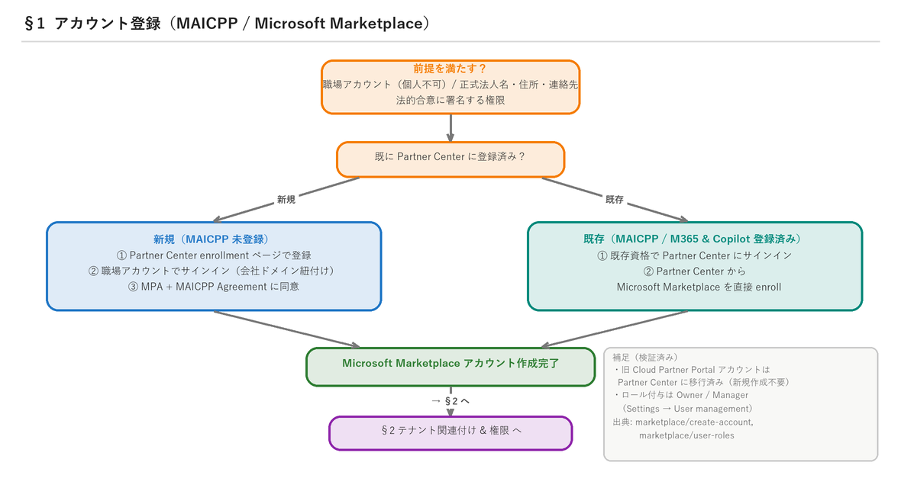
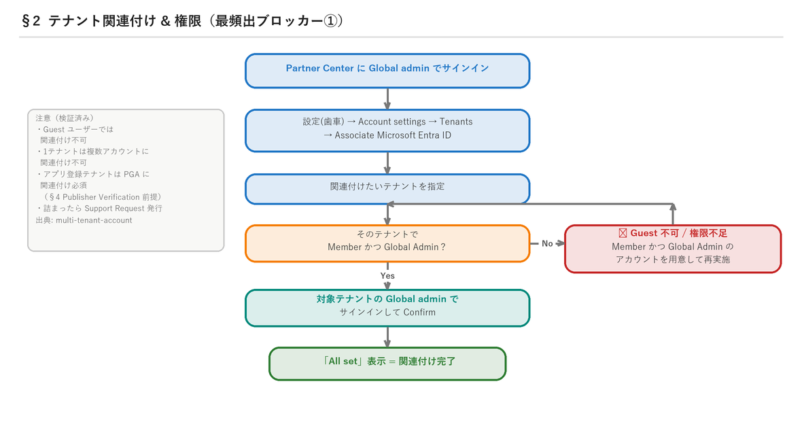
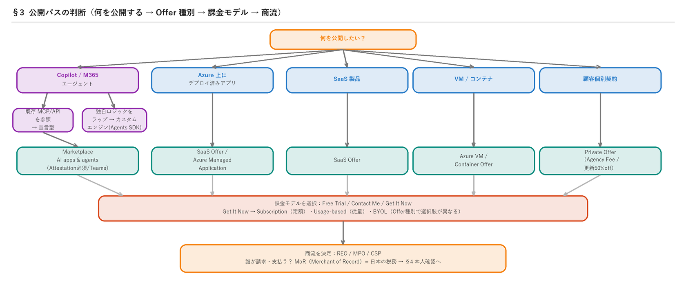
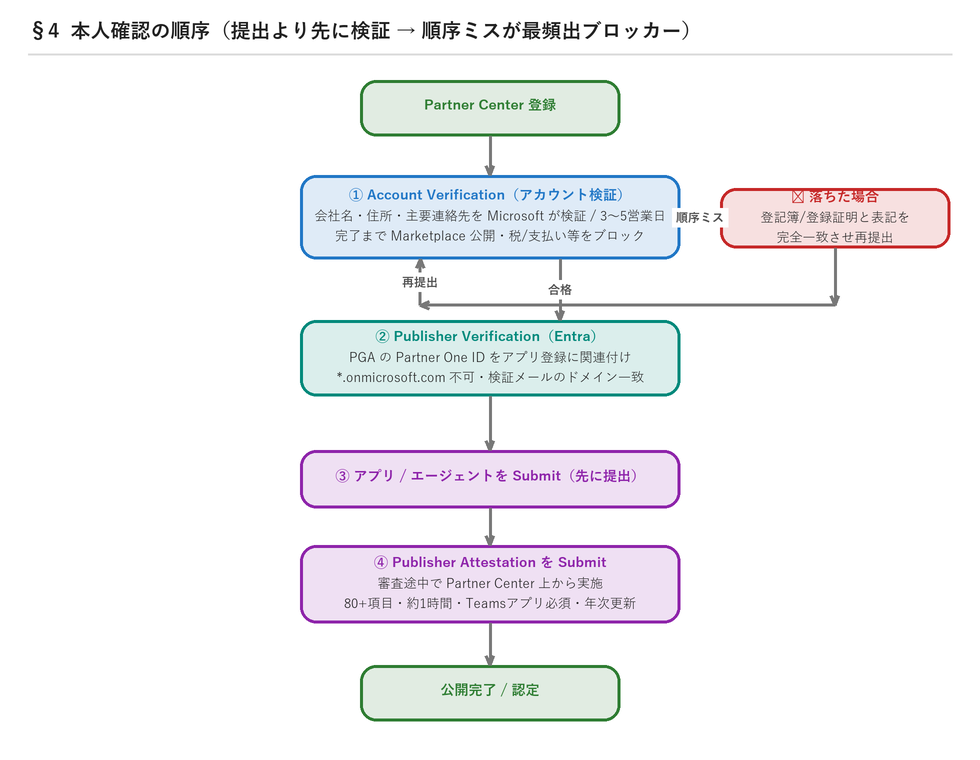

# Partner Center 公開ガイド（入口トリアージ）

パートナー本人または担当営業が **Partner Center オンボーディング〜公開**を自走できるよう、「**今どこで詰まっているか**」を対話で切り分け、**症状 → 原因 → 次アクション + 公式 Learn リンク**で導く。実データ（パートナー質問棚卸し）に基づく頻出ブロッカーを最優先でカバーする。本スキルは「案内」に徹する（本人確認・審査は自動化不可）。

> **このプラグインの入口スキル。** 広域のトリアージ・公開パス判断・REO/MPO・日本税務を担当する。
> **アカウント検証（サインイン／ロール／テナント・App ID／発行元確認／審査の長期化）で深掘りが必要になったら、姉妹スキル [`troubleshoot-account-verification`](../troubleshoot-account-verification) に委譲する**（4条件への収束診断と `verification-ledger.json` を出力）。本スキルの §2 / §4 / §5 はその要点のみを述べ、詳細はそちらに委ねる。

> **EXPERIMENTAL -- guidance only.** Partner Center にサインインしない／ロールを付与しない／Entra を編集しない／代理で Submit しない。パスワードや確認コードを尋ねない・保存しない。

## 実行ルール（このスキルが常に守ること）

このスキルで回答するアシスタントは、毎回次を守る：

1. **UI 手順や URL を提示する前に、該当の Microsoft Learn ページを必ず fetch して最新確認する。** Partner Center の UI・用語・URL は頻繁に変わる。本文のリンクは 2026-06-29 検証だが、提示時点で再確認し、404 や改題があれば訂正する。
2. **断定する事実には必ず Learn 出典（URL）を添える。** 未検証・推測は「未確認」「推定」と明示し、断定しない。
3. **用語の読み替えを常に補正：** MPN→**MAICPP**（Microsoft AI Cloud Partner Program）、Azure AD→**Microsoft Entra ID**、Commercial Marketplace→**Microsoft Marketplace**。
4. **プライバシー：** 相手から提示された会社名・登記情報・テナント等の機微情報を、本人の依頼なく外部や第三者向け文面に含めない。
5. **日本語で応対し**、必要に応じてフロー画像（`pc_flow_*.png`）とチートシート（`REO_MPO_CSP_tax_cheatsheet_JP.md`）を参照させる。
6. **Internal-only 情報を外部（パートナー/営業向け回答）に出さない。** Agency Fee は「標準 3%／更新は 50%off→実効1.5%」までを公開情報として述べ、**手数料の例外・個別優遇など社内限定になり得る情報には立ち入らない**。例外可否を聞かれたら「個別は Microsoft 担当へ」と案内するに留める。

## 会話の進め方

### Step 0｜トリアージ（最初に必ず2問だけ聞く）

長い説明の前に、まず2問で位置づけを掴む：

1. **「何を公開したいですか？」** … Copilot/M365 エージェント / SaaS / VM・コンテナ / 代理店・CSP 経由販売 → 公開パスは **§3**。
2. **「今どの段階で、何に詰まっていますか？」** … 未登録 / 登録済み・審査中 / 公開作業中 / 公開後・出ない。

回答から下表で該当章へ誘導する（複数該当時は番号の小さい＝前段の詰まりから解く）：

| ユーザーの状況・言葉 | 行き先 | 図 |
|---|---|---|
| まだ登録していない / 登録方法を知りたい | §1 アカウント登録 | `pc_flow_register.png` |
| テナント関連付けができない / Entra ID を紐付けられない | §2 テナント関連付け | `pc_flow_tenant.png` |
| 何をどう公開する？ エージェント / Offer 種別 / 課金 / 商流 | §3 公開パス判断（＋チートシート） | `pc_flow_publish.png` |
| 検証・Verification・Attestation の順序／場所がわからない | §4 本人確認の順序 | `pc_flow_verification.png` |
| Developer 審査が通らない・止まる / 提出物 | §5 Developer 審査 | — |
| 上記以外の個別症状・「とにかく動かない」 | §6 症状→原因→次アクション早見表 | — |

### Step 1｜該当章で「症状→原因→次アクション＋Link」を提示

各章は、アシスタントが**そのまま会話で使える知識**として構成。図を見せ、原因を特定し、次アクションと Learn リンク（提示前に再 fetch）を渡す。

## 1. アカウント登録（MAICPP / Marketplace）

**アシスタントの動き方**：相手が「未登録／登録方法」なら、まず下図を見せ「**MAICPP に既に登録済みか**」を確認 → 新規／既存の2経路に分岐して案内。前提3点（職場アカウント・正式法人名/住所/連絡先・署名権限）が揃っているか確認する。提示前に `create-account` を再 fetch。

- 用語：**MPN → MAICPP（Microsoft AI Cloud Partner Program）**、**Azure AD → Microsoft Entra ID**（読み替え必須）。
- Partner global account (PGA) と location ID の違い（Publisher Verification は **PGA の Partner One ID** が必要、location ID は不可）。
- Marketplace プログラムへの enrollment が必要（登録自体は無償、有償特典は別）。
- 前提（Learn 検証済み）：①**会社の職場アカウント（work account）必須**（個人アカウント不可）②会社の正式法人名・住所・主要連絡先を把握 ③**法的合意に署名する権限**を持つこと。
- 登録の2経路（Learn 検証済み）：
  - **新規**（MAICPP 未登録）→ Partner Center enrollment ページで登録 → 職場アカウントでサインイン → Microsoft Publisher Agreement + MAICPP Agreement に同意。
  - **既存**（MAICPP もしくは Microsoft 365 & Copilot プログラム登録済み）→ 既存資格で Partner Center にサインインし、そこから Microsoft Marketplace を直接 enroll。
- 旧 Cloud Partner Portal (CPP) アカウントは Partner Center に移行済み（新規作成不要）。
- 出典: https://learn.microsoft.com/en-us/partner-center/marketplace/create-account （前提・2経路・同意）
- ユーザー/ロール付与: https://learn.microsoft.com/en-us/partner-center/marketplace/user-roles （Marketplace/開発者プログラムは **Owner/Manager** がロール付与可）

## 2. テナント関連付け & 権限（最頻出ブロッカー①）

**アシスタントの動き方**：「関連付けできない」相談では、ほぼ **Guest アカウントで作業している／Global Admin 権限がない**が原因。まず「作業アカウントは関連付け先テナントの **Member かつ Global Admin** か？」を最初に確認する。下図で手順を示す。

> **委譲**：サインイン不可・ロール付与不可・テナント／App ID の一致可否・「Global Admin なのにロールを割り当てられない」など**アイデンティティ/ロールの深掘り**は [`troubleshoot-account-verification`](../troubleshoot-account-verification)（Condition 1/2）へ。

手順（Learn 検証済み）：Partner Center に **Global admin** でサインイン → ⚙ 設定 → **Account settings → Tenants → Associate Microsoft Entra ID** → 関連付けたいテナントを指定 → そのテナントの **Global admin でサインインして Confirm** → 「All set」表示。

- ★**Guest ユーザーでは関連付け不可。** 関連付けるテナント側に **Member かつ Global Admin** のアカウントが必要（Guest は不可）。
- 1テナントは Partner Center で複数アカウントに関連付け不可。
- アプリ登録テナントは PGA に関連付けられている必要（Publisher Verification 前提、§4）。
- 詰まったら Support Request (SR) 発行も選択肢。
- 出典: https://learn.microsoft.com/en-us/partner-center/multi-tenant-account （適切なロール=Global admin、Associate Microsoft Entra ID 手順）

## 3. 公開パスの判断（エージェント / Offer 種別）

**アシスタントの動き方**：「何をどう公開？」には下図で **公開対象 → Offer 種別 → 課金モデル → 商流** の順に絞り込む。商流（REO/MPO/CSP）や手数料・**日本の消費税**を聞かれたら、必ず `REO_MPO_CSP_tax_cheatsheet_JP.md` を開いて答える（特に「日本＝Publisher-Managed で JCT は ISV 自己責任」を外さない）。

意思決定ツリー：

- **Copilot エージェント**：開発オプション **A=宣言型エージェント（既存 MCP サーバー参照）** / **B=カスタムエンジンエージェント（Agents SDK でラップ）**。
- **Azure 上にデプロイしたカスタムエージェント** → Microsoft Marketplace では **SaaS Offer** または **Azure Managed Application** として公開可。
- Offer 種別（Learn 検証済み）：SaaS / Azure VM / Azure Application（Managed app / Solution template）/ Azure Container / Professional service / Dynamics 365 / Power BI App / Managed Service。
- **リスティング/課金オプション**（Learn 検証済み）：**Free Trial / Contact Me / Get It Now**。Get It Now 配下に **Get It Now (Free) / BYOL / Subscription / Usage-based pricing（従量課金）**。Offer 種別ごとに選べるモデルが異なる（例：SaaS は Subscription/Usage-based 両対応、VM は Usage-based）。
- 商流：**REO vs MPO vs CSP**（誰が誰に請求・支払うか、日本の税務/MoR）。→ §6 課金チートシート参照。
- **詳細チートシート（別ファイル）**: `REO_MPO_CSP_tax_cheatsheet_JP.md`（商流4モデル比較・Agency Fee・**日本=Publisher-Managed で JCT は ISV 自己責任**・W-8/W-9）。
- 出典: https://learn.microsoft.com/en-us/partner-center/marketplace-offers/overview （Marketplace 概要・公開できる製品）
- 出典: https://learn.microsoft.com/en-us/partner-center/marketplace-offers/determine-your-listing-type （Offer 種別 × リスティング/課金モデルの対応表）
- 出典: https://learn.microsoft.com/en-us/microsoft-365/agents-sdk/ （Agents SDK ハブ）

## 4. 本人確認の順序（最頻出ブロッカー②）

**アシスタントの動き方**：「Attestation が見つからない」「検証が終わらない」「順序がわからない」は全てここ。**順序＝①Account Verification →②Publisher Verification →③アプリを Submit →④審査中に Attestation を Submit**。「Attestation が最初から無い」は **Submit 前に探している**のが原因（③→④の順を案内）。**①Account Verification（Legal info=Authorized）は最上位ゲート**：これが未完了だと「有料プラン作成不可」「税/支払プロファイル更新不可」「Marketplace 公開不可」が同時に起き、`not publish eligible … invalid payout/tax` の形でも現れる（§6 参照）。下図を見せる。

> **委譲**：本人確認が**実際にブロックしている**ケース（4条件への収束診断・`verification-ledger.json` 出力・発行元確認 vs ビジネス検証の用語切り分け）は [`troubleshoot-account-verification`](../troubleshoot-account-verification) に委ねる。本節は順序の地図だけを示す。

正しい順序を明示（実データで最も誤解が多い）：

1. **Account Verification（アカウント検証）**：Partner Center 登録時、会社名・住所・主要連絡先を Microsoft が検証。通常 **3〜5 営業日**、5日超で要サポート。**検証完了まで Marketplace 公開・税/支払いプロフィール更新・マルチテナント等がブロック**される。検証メールは会社ドメインの監視可能な業務メールで（個人メール不可）。出典: https://learn.microsoft.com/en-us/partner-center/enroll/verification-responses
2. **Publisher Verification（Entra）**：PGA の verified **Partner One ID** をアプリ登録に関連付け。要件＝職場/学校アカウントで登録・publisher domain 設定（`*.onmicrosoft.com` 不可）・検証メールのドメイン一致・登録者は Entra と Partner Center 双方で必要ロール保持。出典: https://learn.microsoft.com/en-us/entra/identity-platform/publisher-verification-overview
3. **Publisher Attestation**：**先にアプリ/エージェントを Submit → 審査途中で Partner Center 上から Attestation を Submit**（「最初から見当たらない」が頻出）。80+ 項目の自己申告、約1時間、**Teams アプリは必須**、年次更新。対象＝Word/Excel/Outlook/Teams/Copilot/SharePoint/SaaS 等。出典: https://learn.microsoft.com/en-us/microsoft-365-app-certification/docs/attestation

## 5. Developer 審査 & 提出物（最頻出ブロッカー③）

**アシスタントの動き方**：「審査が通らない／止まる」は、まず **登記簿（設立書類・政府発行の登録証明）の社名・住所と Partner Center の表記が完全一致しているか**を確認させる（表記揺れが最頻原因）。ロール過剰付与・提出物不足も併せて点検。

> **委譲**：ロール権限の詳細（Owner/Manager/Developer vs Account admin の取り違え）やビジネス検証エビデンスは [`troubleshoot-account-verification`](../troubleshoot-account-verification)（Condition 1/3）へ。

- ★**登記簿謄本の会社名・住所と Partner Center の表記が不一致だと Developer 審査に落ちる。** 設立書類・政府発行の登録証明と**完全一致**させて再提出。表記揺れ（全半角・旧新社名・住所表記）を解消。
- **検証ペンディング中はブロックされる機能**（実害を案内）：Marketplace 公開、税/支払いプロフィール、ビリングプロファイル作成/更新、マルチテナント、会員購入/更新、co-sell、顧客追加。出典: verification-responses。
- ロール（Developer programs=Marketplace/M365&Copilot 等は **Manager / Owner**）：**Developer=公開作業 / Manager=Developer付与+収益管理 / Owner=所有者**（過剰付与のリスク）。出典: verification-responses（Appropriate roles）。
- 提出物：**manifest.json 構成**、ロケール、**Additional Certification Info（審査用テストアカウント/テスト実行方法）**、デモ動画。
- Marketplace のユーザー/ロール追加（Learn 検証済み）：Partner Center → Settings → Account settings → **User management** から付与。Marketplace/開発者プログラムは **Owner/Manager** がロール付与可（MAICPP は Global admin/Account admin/User management admin）。出典: https://learn.microsoft.com/en-us/partner-center/marketplace/user-roles
- 複数 Publisher を持つ場合の追加手順: https://learn.microsoft.com/en-us/partner-center/marketplace/add-publishers

## 6. 症状 → 原因 → 次アクション チートシート

| 症状（ユーザーの声） | 原因 | 次アクション | Learn |
|---|---|---|---|
| テナント登録（関連付け）ができない | Guest で作業 / 権限不足 | Member+Global Admin で実施、ダメなら SR | multi-tenant-account ✅ |
| Developer 審査が通らない/止まる | 登記簿と Partner Center の表記不一致 | 法的書類と完全一致で再提出 | verification-responses ✅ |
| Publisher Attestation の場所がない | Submit 前に探している | 先に Submit→審査中に Partner Center で Attestation | attestation ✅ |
| 検証が終わらない（5日超） | 審査滞留 | サポートに連絡（3-5営業日が目安） | verification-responses ✅ |
| Marketplace に Offer が出ない / 404 | 検証未完了 / 公開未完了 / 反映待ち | 検証ステータス＋公開ステータス確認 | verification-responses ✅ |
| 有料プラン作成でエラー：`not publish eligible due to either an invalid payout, payout on hold, or invalid tax` | プロファイルが「Complete」でも **Account Verification(Legal info) が未 Authorized**、または税フォーム未送信／割当先が開発者プロファイルでない／48h検証待ち | **①最初に Legal info=Authorized を確認**（検証 Pending 中は税/支払更新も公開もブロック）→ ②税フォームを Finish→Done まで送信 →③Payout and tax profile assignment で開発者プロファイルが対象 Seller ID に割当 →④48h待ち →⑤なお残ればサポート起票 | verification-responses ✅ / set-up-your-payout-account ✅ / payout-faq ✅ |
| ISV Success だけで適格か | 開発者プログラム適格 | 職場アカウントでサインインすると保有適格が表示される（要確認・UI変動） | [要確認] |
| Marketplace Offers ワークスペース／公開・編集操作が画面に出てこない | 開発者プログラムのロール（Owner/Manager/Developer）が未付与 | User management で付与（Submit中心=Developer、価格まで=Manager、全権=Owner）。付与は Owner/Manager（無ければ Global admin）。反映に最大1h | permissions-overview ✅ / user-roles ✅ |
| 課金体系が複雑（従量/Private Offer/Agency Fee） | Marketplace 課金モデル理解 | リスティング種別ごとにモデルを整理（Subscription/Usage-based/BYOL）。Private Offer 更新は Agency Fee 50%off を作成時に self-attest | listing-type ✅ / agency-fee ✅ |

**エラー文の語句別マッピング**（`not publish eligible …` の3語句で原因を切り分ける／2026-06-29 実地検証）：
- `invalid tax` → 税フォームが Finish→Done まで未送信／期限切れ／割当先が開発者プロファイルでない。
- `payout on hold` → Payout profile で **Hold** が ON（意図せず保留）。解除する。
- `invalid payout` → 支払プロファイル未完了／対象 Seller ID に未割当。
- 3語句のどれでも、**まず ① Account Verification(Legal info)=Authorized を最優先で確認**（検証 Pending 中は更新も公開も同時にブロック）。割当画面に enrollment が見えない＝**ロール不足／別アカウントでサインイン**（Owner / Financial Contributor が必要）。

## 7. 用語集（ドリフト対応）

MPN→MAICPP / Azure AD→Entra ID / Commercial Marketplace→Microsoft Marketplace / PGA / Partner One ID / REO / MPO / CSP / Account Verification / Publisher Verification / Publisher Attestation / Developer・Manager・Owner ロール。

## Starter Conversations（このスキルの呼び水）

ユーザーがそのまま選べる代表質問。アシスタントは選択された質問から Step 0 トリアージに入る：

1. 「Partner Center にこれから登録したい。何から始めればいい？」 → §1
2. 「テナント（Entra ID）の関連付けができない。どうすれば？」 → §2
3. 「Copilot エージェントを公開したい。宣言型とカスタムエンジン、どっち？」 → §3
4. 「Publisher Attestation の項目が見当たらない。」 → §4
5. 「Developer 審査が通らない（登記簿と表記が違うと言われた）。」 → §5
6. 「代理店／CSP 経由で売りたい。REO と MPO の違いと、日本の消費税はどうなる？」 → §3＋チートシート

## 参照（一次ソース・fetch 検証済み 2026-06-29 / 提示前に再確認）

- Marketplace アカウント作成/enroll（前提・2経路・CPP移行）: https://learn.microsoft.com/en-us/partner-center/marketplace/create-account ✅
- Marketplace ユーザー/ロール（Owner/Manager がロール付与/付与手順）: https://learn.microsoft.com/en-us/partner-center/marketplace/user-roles ✅
- Publisher 追加（複数 Publisher 運用）: https://learn.microsoft.com/en-us/partner-center/marketplace/add-publishers ✅
- Marketplace 概要（公開可能な製品・販路）: https://learn.microsoft.com/en-us/partner-center/marketplace-offers/overview ✅
- リスティング/課金モデル対応表（Free Trial/Contact Me/Get It Now・Subscription/Usage-based/BYOL）: https://learn.microsoft.com/en-us/partner-center/marketplace-offers/determine-your-listing-type ✅
- Agency Fee 更新割引（Private Offer 更新で50%off・作成時 self-attest）: https://learn.microsoft.com/en-us/partner-center/marketplace-offers/agency-fee-discount-for-renewals ✅
- SaaS Offer 作成: https://learn.microsoft.com/en-us/partner-center/marketplace-offers/create-new-saas-offer ✅
- Publisher Verification: https://learn.microsoft.com/en-us/entra/identity-platform/publisher-verification-overview ✅
- アカウント検証（ブロック機能/3-5営業日/ロール）: https://learn.microsoft.com/en-us/partner-center/enroll/verification-responses ✅
- マルチテナント関連付け（Global admin/Associate 手順）: https://learn.microsoft.com/en-us/partner-center/multi-tenant-account ✅
- Publisher Attestation（80+項目/年次/Teams必須）: https://learn.microsoft.com/en-us/microsoft-365-app-certification/docs/attestation ✅
- Agents SDK ハブ: https://learn.microsoft.com/en-us/microsoft-365/agents-sdk/ ✅
- 商流・税務の詳細: 同梱 `REO_MPO_CSP_tax_cheatsheet_JP.md`（一次ソース10本を内包）

---
*開発・保守メモは `DEV_NOTES.md` を参照（出荷物には含めない）。*
