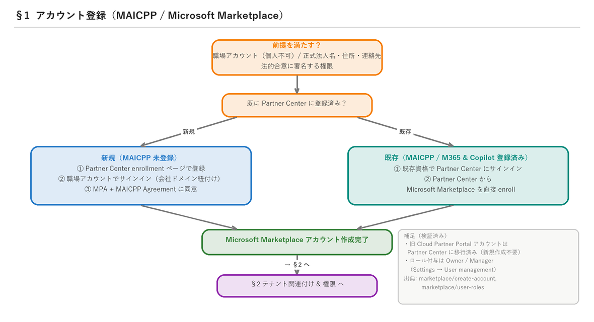
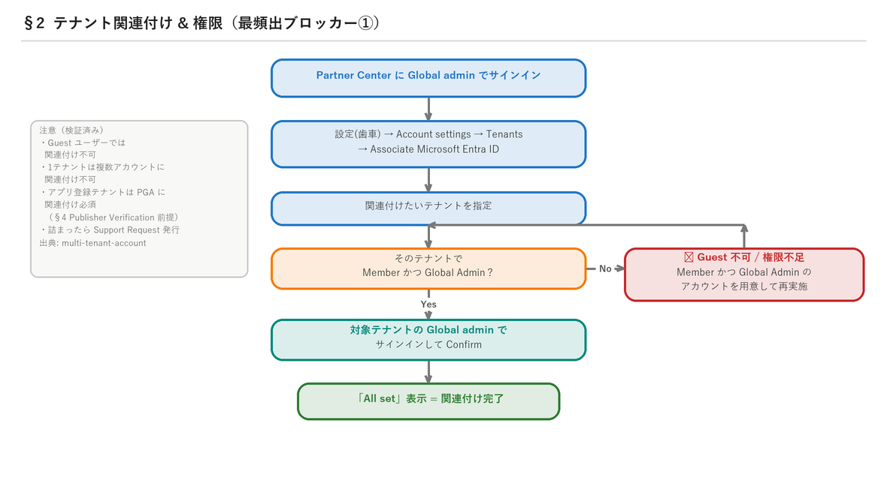
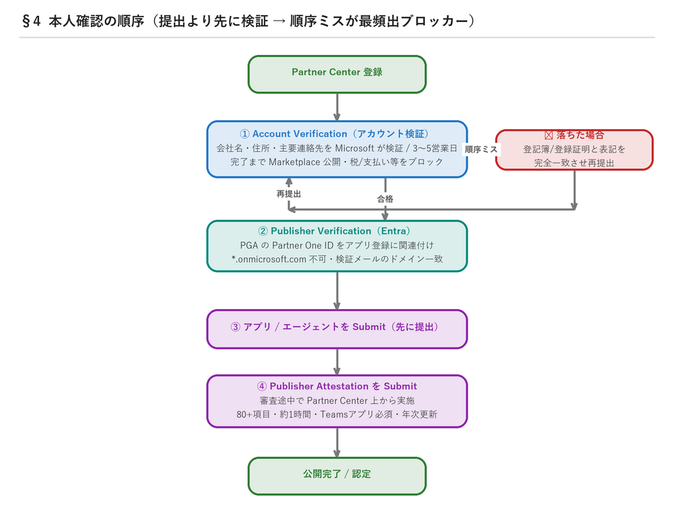
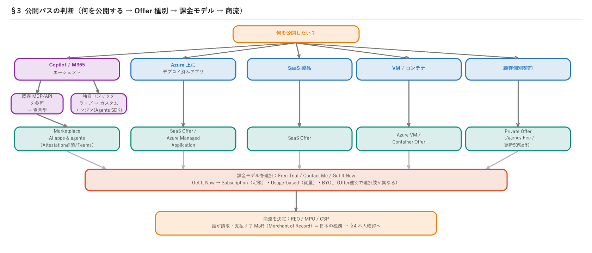

# Partner Center 公開ガイド（入口トリアージ）

> **入口スキル。** 登録、テナント関連付け、検証順序、公開パス、Store validation、商流/FX/税務/購買を症状→原因→次アクションへ整理する。本人確認そのものがブロッカーなら `troubleshoot-account-verification` へ委譲する。

## 実行ルール

1. **ガイダンスのみ。** Partner Center、Entra、Azure、Marketplace へサインインしない。ロール付与、契約同意、価格/税/支払更新、公開申請、購入、ポータル書き込みをしない。
2. **公開根拠を明示。** UI 名、ロール、国/通貨、CSP/MPO/REO、FX、税、請求、審査、認定は Microsoft Learn を fetch して、提示 URL と fetch 日を添える。公開事実からの合理的推論は可だが「推論」と明示する。
3. **機密を集めない。** パスワード、確認コード、実在顧客名、取引額、契約番号、秘密 URL、未公開 partner/customer 名は聞かない。必要なら「Owner 権限の有無」「Legal info の状態」「Japan market / JPY billing」など抽象化する。本人が許可して提示した具体情報はその会話内だけで使い、公共知識へ残さない。
4. **URL は正確に。** 省略記号や「この画面」だけにせず、フルの canonical Learn URL を出す。変更が疑われる画面名は「fetch 時点」と書く。
5. **回答は必要十分に。** まず actor（ISV/CSP/購入者/管理者）、surface（Partner Center/Entra/Marketplace/Azure Billing）、scope（公開事実/推論/未確認）を短く置く。ユーザーが1-2文を求めたら、形式を短縮してよい。
6. **図と添付を使う。** 登録/テナント/公開/検証の相談では該当 `pc_flow_*.png` を参照。商流/FX/税/PO は `REO_MPO_CSP_tax_cheatsheet_JP.md` を開いて必要箇所だけ使う。

## Step 0｜最初に聞く2問

1. **何をしたい/直したいですか?** 登録 / テナント関連付け / 本人確認 / Publisher Verification / Attestation・Certification / SaaS・エージェント公開 / Store validation / Private Offer・CSP・REO・MPO / FX・請求・PO。
2. **誰の立場ですか?** ISV/Publisher、CSP Direct Bill、Indirect Provider、Indirect Reseller、購入者、Entra/Partner Center 管理者、支援者。

必要なら追加 1-2 問だけ: 「どの画面/ステータスか」「公開対象は SaaS/VM/Apps and agents for Microsoft 365 and Copilot か」「国/market currency と billing currency は同じか」。

| 状況 | 行き先 | 図 |
| --- | --- | --- |
| 未登録/登録方法 | §1 | `pc_flow_register.png` |
| テナント関連付け/権限 | §2 | `pc_flow_tenant.png` |
| 検証/Attestation/Certification の順序 | §3 | `pc_flow_verification.png` |
| 何をどう公開する/商流を選ぶ | §4 | `pc_flow_publish.png` |
| Store validation Must-fix | §5 | - |
| CSP/FX/税/PO | §6 + チートシート | - |

## 1. アカウント登録（MAICPP / Marketplace）

相手が未登録ならまず `pc_flow_register.png` を示し、**MAICPP 登録済みか**で分ける。

- 用語: MPN→**MAICPP**、Azure AD→**Microsoft Entra ID**、Commercial Marketplace→**Microsoft Marketplace**。
- 前提: 会社の work account（個人アカウント不可）、正式法人名/住所/primary contact、法的合意へ署名する権限。
- **新規**: Partner Center の Microsoft Marketplace account 作成/Marketplace program enrollment へ進む。
- **既存**: 既存 Partner Center/MAICPP/Microsoft 365 & Copilot program の資格でサインインし、Marketplace program enrollment を確認。
- 旧 Cloud Partner Portal アカウントは Partner Center へ移行済み。新規作成前に既存有無を確認。
- Legal profile の会社名/住所/primary contact 更新は再検証を起こし得る。完了時間や無停止は保証しない。
- PGA、location ID、Seller ID、Publisher ID、Partner One ID、Entra application (client) ID、tenant ID を混同しない。

publicSources:
- https://learn.microsoft.com/en-us/partner-center/account-settings/create-account
- https://learn.microsoft.com/en-us/partner-center/account-settings/update-your-partner-profile
- https://learn.microsoft.com/en-us/partner-center/enroll/understand-the-verification-process

## 2. テナント関連付け・ロール・権限

「関連付けできない」は、作業者が対象テナントの **Member ではない / Global Admin ではない / Partner Center 側ロールがない**ことが多い。`pc_flow_tenant.png` を使って actor と surface を分ける。

- Entra Global Admin だけで Marketplace/Developer/MAICPP の全実行権限が自動的に揃うわけではない。
- Partner Center workspace access は Partner Center ロールで管理。Marketplace/Developer には **Owner / Manager / Developer**、MAICPP には **Account Admin / Partner Admin / Compliance Admin** など program-specific ロールがある。
- ユーザー追加は「Entra メンバー化」→「Partner Center ロール付与」の2段階。本人の権限確認は Account settings > Overview > View permissions。
- テナント関連付けの実行者は、関連付けるテナント側の Member + Global Admin を満たす必要がある。Guest では失敗する。
- アプリ登録テナントは PGA と関連付いている必要があるため、Publisher Verification の前に tenant/PGA/Partner One ID の取り違えを解く。
- サインイン不可、ロール付与不可、Global Admin なのに見えない等は `troubleshoot-account-verification` へ委譲。

publicSources:
- https://learn.microsoft.com/en-us/partner-center/account-settings/permissions-overview
- https://learn.microsoft.com/en-us/partner-center/account-settings/multi-tenant-account
- https://learn.microsoft.com/en-us/entra/identity-platform/publisher-verification-overview

## 3. 本人確認・Publisher Verification・Attestation・Certification

「検証」「認定」「バッジ」は同じではない。順序確認には `pc_flow_verification.png` を示す。

| 層 | Surface | 意味 | よくある誤解 |
| --- | --- | --- | --- |
| Account / business verification | Partner Center | 法人・連絡先・本人等の確認。未完了だと公開/購入/設定変更が制限され得る | Entra 管理者なら自動通過、ではない |
| Publisher Verification | Entra app registration | multitenant app の consent prompt 等に verified publisher を表示 | 品質/セキュリティ認証ではない |
| Publisher Attestation | Microsoft 365 App Certification portal/Partner Center | security/data/compliance 自己申告。Microsoft は内容を独立検証しない | Certification 監査と同じではない |
| Microsoft 365 Certification | Microsoft 365 App Certification | security/privacy の独立監査。Attestation 等が前提 | すべての control が自動免除されるわけではない |
| Solutions Partner with Certified Software | Partner Center Referrals | solution 単位の designation 要件 | 1つの Solution ID が全 Offer へ波及するとは限らない |

対応:
- 「Attestation が見当たらない」→ Offer 種別、提出状態、Apps and agents for Microsoft 365 and Copilot 系か、Owner/Manager 権限を確認。Submit 前なら表示されないことがある。
- 「Publisher Verification 済みなら Certification も済み?」→ いいえ。Entra の verified badge、Attestation、Certification、CSD は目的と範囲が別。
- 「Legal info が Pending/Rejected」「not publish eligible due to either an invalid payout, payout on hold, or invalid tax」→ 最初に Legal info / verification status を確認し、本人確認が実ブロッカーなら専門スキルへ委譲。

publicSources:
- https://learn.microsoft.com/en-us/partner-center/enroll/understand-the-verification-process
- https://learn.microsoft.com/en-us/entra/identity-platform/publisher-verification-overview
- https://learn.microsoft.com/en-us/microsoft-365-app-certification/docs/attestation
- https://learn.microsoft.com/en-us/microsoft-365-app-certification/docs/certification
- https://learn.microsoft.com/en-us/partner-center/referrals/solutions-partner-certified-software-solution-area

## 4. 公開パスと SaaS 境界

「何をどう公開する?」には `pc_flow_publish.png` で **公開対象 → Offer 種別 → 課金モデル → 商流** の順に絞る。

- Copilot/M365 エージェントの提出可否は「どの agent/app 種別か」「外部 SaaS と連携するか」「購入/管理を Marketplace 経由にするか」で分ける。詳細な提出ワークシートは Cowork には同梱していないため、必要時は Learn の提出ガイドを再 fetch して案内する。
- SaaS Offer は publisher が顧客利用を支える infrastructure を管理し、Marketplace の SaaS subscription lifecycle/fulfillment とつながる。任意コード配布やローカル導入物を即 SaaS と判定しない。
- 追加クレジット/消耗枠は「既存 subscription 更新」「quantity」「metered usage」「別 plan/SKU」「new private offer」「別 product purchase」のどれかに分ける。
- transactable SaaS は landing page、webhook、SaaS Fulfillment APIs、auto activation、SSO/consent 開示が論点。実装認定はしない。
- Store validation はこの §4 の一文で終わらせず、§5 のチェックリストへ進める。

publicSources:
- https://learn.microsoft.com/en-us/partner-center/marketplace-offers/plan-saas-offer
- https://learn.microsoft.com/en-us/partner-center/marketplace-offers/create-new-saas-offer
- https://learn.microsoft.com/en-us/partner-center/marketplace-offers/create-new-saas-offer-plans
- https://learn.microsoft.com/en-us/partner-center/marketplace-offers/create-new-saas-offer-technical
- https://learn.microsoft.com/en-us/partner-center/marketplace-offers/pc-saas-fulfillment-life-cycle
- https://learn.microsoft.com/en-us/legal/marketplace/certification-policies

## 5. Store validation / Must-fix（リスティング・コンテンツ審査）

提出後の差し戻しは、Partner Center の設定値ではなく **app manifest と AppSource/Partner Center listing 記載**の不備が多い。最初の返答は「指摘番号/スクショの文言」「manifest と listing のどちらを直したか」「first-run 体験に導線があるか」を確認し、以下だけを優先する。

### 5.1 way forward（sign-up / Get Started / Contact / Help）

- 外部アカウント/サービス、管理者の事前同意、前提ライセンスが必要な場合、新規ユーザーが sign up できる、または publisher に問い合わせられる **way forward** を用意する。
- 置く場所は **3か所**: 1) app manifest の description 2) AppSource/Partner Center の long description 3) 初回起動体験（welcome message、setup/config page、first-run card 等）。1か所だけでは再差し戻しになり得る。
- Good-to-fix でも、リンクはクリック可能な HTTPS URL にする。認証が必要な support portal だけにしない。
- ポリシー番号は Teams の access to services 系（1140.1.4）として扱い、Security/Tabs の番号と混同しない。

### 5.2 manifest と listing の一貫性

- app name、developer name、short/long description は manifest と AppSource/Partner Center で一致させる。片方だけ直すと不一致で落ちる。
- app ID は更新で維持し、version を SemVer で上げる。Dev/Beta/Preview/UAT 等の非公開ラベルを production 名に残さない。
- manifest/Partner Center/Cowork manifest の説明文で、できること・前提・制限・support 導線を同じ表現に寄せる。

### 5.3 EULA / privacy / support / accessibility

- EULA/terms、privacy policy、support URL は対象 offer に適用可能で、HTTPS、認証不要、manifest と listing で同一にする。
- privacy policy は連絡先を含める。support URL はサインインなしで問い合わせ手段へ到達できるページにする。
- アクセシビリティ、スクリーンショット、アイコン、テスト可能性、M365/Copilot app policy の指摘は、該当 Learn の Must-fix/Good-to-fix の区分で切り分ける。

### 5.4 エージェント/Cowork の説明文

- short description、command/parameter/semantic description、operation ID、instructions、conversation starters に命令句、URL、絵文字、隠し文字、文法/句読点誤りを入れない。
- long description は Markdown 可だが、ヘルプ/サポートリンクを含め、過度な長文、AppSource への自己リンク、"MS"/"MSFT" 略記、誇大表現を避ける。
- Cowork の詳細 submission worksheet はこのプラグインに同梱していない。必要なら Microsoft Learn の該当提出手順を再 fetch して、ユーザーの offer 種別ごとに作業表をその場で作る。

### 5.5 差し戻し後の初動

1. Failure report の指摘文/スクリーンショットを policy 番号で分類する。
2. manifest と Partner Center listing の両方を同じ内容へ修正する。
3. support/privacy/EULA/way-forward の URL を匿名ブラウザーで開けるか確認する。
4. test account / test steps / demo video / first-run path が審査者に再現可能か確認する。
5. version を上げ、App ID を変えずに production manifest を再提出する。理由が曖昧なら Support Request。

publicSources:
- https://learn.microsoft.com/en-us/microsoftteams/platform/concepts/deploy-and-publish/appsource/prepare/teams-store-validation-guidelines
- https://learn.microsoft.com/en-us/microsoftteams/platform/concepts/deploy-and-publish/appsource/prepare/review-copilot-validation-guidelines
- https://learn.microsoft.com/en-us/legal/marketplace/certification-policies#1140-teams

## 6. 商流・CSP・FX・税・購買

詳細は必ず `REO_MPO_CSP_tax_cheatsheet_JP.md` を開き、そこから必要部分だけ答える。

### FX / 通貨

- 「価格入力と3つの換算先」を分ける: Offer input currency、market currency、billing currency、payout currency。
- USD 価格を初回保存すると market currency の価格が作られ、その local/market price は publisher が価格変更するまで自動追随しない。
- **market currency と billing currency が異なる場合だけ**、請求時に monthly FX で billing currency へ換算される。payout currency が異なる場合の換算は別問題。
- Japan market は JPY。顧客の billing currency も JPY なら market-to-billing の追加 FX はないが、数量、税、更新、metering、invoice timing まで固定とは言えない。
- Private Offer の currency mismatch は customer doc と publisher FAQ で表現が異なる。absolute pricing が不可の場面では percentage discount/private plan 等を確認し、自動適用を断定しない。

### CSP

- CSP Private Offer の margin を受ける側は active CSP program の **Direct Bill または Indirect Provider**。Indirect Reseller には ISV が直接 margin を出せず、Provider 経由で扱う。
- CSP status は CSP 側の Program info/Reseller tab で確認する。ISV が選ぶ相手は CSP partner name / tenant ID で、Seller ID、Publisher ID、buyer tenant ID と混同しない。
- Marketplace publisher enrollment、transactable offer、tax/payout profile は ISV/publisher 側の前提であり、「CSP が active なら seller/tax/payout も揃う」という意味ではない。
- CSP margin は CSP partner 向け。CSP は Microsoft から wholesale price で請求を受け、顧客価格と顧客請求は Marketplace 外で管理する。end customer に margin が見える/自動還元されるとは言わない。
- CSP agreements を既に締結済みなら Marketplace offers 販売のためだけに再署名不要と Learn は説明するが、offer 個別契約や ISV/customer/partner 追加契約はあり得る。

### 税・購買

- Japan は tax-details の Microsoft-managed/reseller 表に載らないため、Learn の定義上 Publisher/Developer-managed と扱うのが安全な公開根拠。JCT 登録・計算・徴収・納付・適格請求書は専門家確認へ。
- 請求/費用帰属は **Offer(product) / Private Offer(terms) / Azure subscription(resource scope) / SaaS subscription / Purchase Order / invoice** を分ける。
- PO mapping は publisher ID / offer ID 等の scope で future charge を割り当てる機能。部署別割合や private offer 別配賦を自動保証しない。
- Private offer は accept だけでは課金開始とは限らない。purchase/subscribe/activate と対象 product ごとの購入を確認する。

publicSources:
- https://learn.microsoft.com/en-us/marketplace/currencies
- https://learn.microsoft.com/en-us/partner-center/marketplace-offers/commercial-marketplace-fx-faq
- https://learn.microsoft.com/en-us/partner-center/marketplace-offers/marketplace-geo-availability-currencies
- https://learn.microsoft.com/en-us/partner-center/marketplace-offers/isv-csp-reseller
- https://learn.microsoft.com/en-us/partner-center/customers/csp-commercial-marketplace-margins
- https://learn.microsoft.com/en-us/partner-center/customers/csp-commercial-marketplace-contracting
- https://learn.microsoft.com/en-us/partner-center/marketplace-offers/tax-details-marketplace
- https://learn.microsoft.com/en-us/marketplace/billing-invoicing
- https://learn.microsoft.com/en-us/marketplace/purchase-orders
- https://learn.microsoft.com/en-us/marketplace/purchase-order-mapping
- https://learn.microsoft.com/en-us/marketplace/private-offers-purchase

## 7. 症状別ルーティング

| 症状 | まず確認 | 返し方 |
| --- | --- | --- |
| 登録/Legal info が Authorized でない | program、overall/detailed status、primary contact | `troubleshoot-account-verification` へ委譲 |
| テナント関連付け/Publisher Verification が失敗 | Guest でないか、PGA Partner One ID、tenant association、publisher domain、両 surface のロール | §2-3 |
| Attestation/Certification の場所や意味が不明 | Offer 種別、提出状態、目的が自己申告か監査か | §3 |
| SaaS かどうか/追加クレジット | who hosts/operates、what customer buys、subscription/meter/plan 更新か新規購入か | §4 |
| Store validation Must-fix | policy番号、manifest/listing一致、way forward 3か所、support/privacy/EULA、first-run/testability | §5 |
| CSP で売りたい/売れない | 相手が Direct Bill/Indirect Provider か、CSP status、target CSP tenant ID/name | §6 + cheatsheet |
| FX/円建て/Private Offer currency | market currency、billing currency、payout currency、public price/private offer/private plan | §6 + cheatsheet |
| 請求/部署/PO | billing account type、Azure subscription、SaaS subscription、publisher/offer ID、PO mapping scope | §6 |
| 支援プログラム/ISV Success・Marketplace Rewards はどこ? | ISV Success・Marketplace Rewards・Azure IP co-sell・CSD は Frontier Accelerate for Marketplace（FAM、2026年9月 GA）へ統合。既存メンバーは移行。無償版と有償 Premium、Build and Publish→Grow→Differentiate | FAM overview/FAQ を fetch して案内。金銭インセンティブの条件は Incentives Guide。個別の適格可否・金額は断定せず Microsoft 担当へ |

## Starter Conversations

1. 「Partner Center にこれから登録したい。最初の確認だけ教えて。」→ Step 0 + §1
2. 「Legal info が Pending/Rejected。何を見ればよい?」→ verification specialist
3. 「Entra の Publisher Verification と Attestation と Certification の違いは?」→ §3
4. 「Store validation で way forward / Contact が無いと言われた。」→ §5
5. 「CSP 経由で販売したい。ISV/CSP/顧客の誰が何をする?」→ §6 + cheatsheet
6. 「日本円の Private Offer で FX リスクをどう説明する?」→ §6 + cheatsheet
7. 「追加クレジットを売りたい。SaaS plan/meter/private offer のどれ?」→ §4
8. 「請求書と PO と Azure subscription の関係が混乱している。」→ §6 + cheatsheet
9. 「ISV Success や Marketplace Rewards は今どうなっている? 公開の支援策は?」→ §7（FAM）

## 参照（一次ソース・2026-09-12 fetch 確認。提示前に再 fetch）

- Create Marketplace account: https://learn.microsoft.com/en-us/partner-center/account-settings/create-account
- Roles/permissions: https://learn.microsoft.com/en-us/partner-center/account-settings/permissions-overview
- Tenant association: https://learn.microsoft.com/en-us/partner-center/account-settings/multi-tenant-account
- Legal profile update: https://learn.microsoft.com/en-us/partner-center/account-settings/update-your-partner-profile
- Verification process: https://learn.microsoft.com/en-us/partner-center/enroll/understand-the-verification-process
- Publisher verification: https://learn.microsoft.com/en-us/entra/identity-platform/publisher-verification-overview
- Publisher Attestation: https://learn.microsoft.com/en-us/microsoft-365-app-certification/docs/attestation
- Microsoft 365 Certification: https://learn.microsoft.com/en-us/microsoft-365-app-certification/docs/certification
- Certified Software designation: https://learn.microsoft.com/en-us/partner-center/referrals/solutions-partner-certified-software-solution-area
- Frontier Accelerate for Marketplace (2026-10-02 fetch): https://learn.microsoft.com/en-us/partner-center/frontier-accelerate-marketplace/overview / FAQ https://learn.microsoft.com/en-us/partner-center/frontier-accelerate-marketplace/faq / https://aka.ms/fa-for-marketplace / Resources https://aka.ms/FAM-Resources / Incentives Guide https://aka.ms/incentivesguide
- SaaS planning/technical/lifecycle: https://learn.microsoft.com/en-us/partner-center/marketplace-offers/plan-saas-offer
- SaaS plans/pricing: https://learn.microsoft.com/en-us/partner-center/marketplace-offers/create-new-saas-offer-plans
- SaaS technical config: https://learn.microsoft.com/en-us/partner-center/marketplace-offers/create-new-saas-offer-technical
- SaaS lifecycle: https://learn.microsoft.com/en-us/partner-center/marketplace-offers/pc-saas-fulfillment-life-cycle
- Marketplace policies: https://learn.microsoft.com/en-us/legal/marketplace/certification-policies
- Teams Store validation: https://learn.microsoft.com/en-us/microsoftteams/platform/concepts/deploy-and-publish/appsource/prepare/teams-store-validation-guidelines
- Agent/Cowork validation: https://learn.microsoft.com/en-us/microsoftteams/platform/concepts/deploy-and-publish/appsource/prepare/review-copilot-validation-guidelines
- FX customer: https://learn.microsoft.com/en-us/marketplace/currencies
- FX publisher FAQ: https://learn.microsoft.com/en-us/partner-center/marketplace-offers/commercial-marketplace-fx-faq
- Geo/currency: https://learn.microsoft.com/en-us/partner-center/marketplace-offers/marketplace-geo-availability-currencies
- CSP private offers: https://learn.microsoft.com/en-us/partner-center/marketplace-offers/isv-csp-reseller
- CSP margins: https://learn.microsoft.com/en-us/partner-center/customers/csp-commercial-marketplace-margins
- CSP contracting: https://learn.microsoft.com/en-us/partner-center/customers/csp-commercial-marketplace-contracting
- Tax responsibilities: https://learn.microsoft.com/en-us/partner-center/marketplace-offers/tax-details-marketplace
- Billing/invoicing: https://learn.microsoft.com/en-us/marketplace/billing-invoicing
- Purchase orders: https://learn.microsoft.com/en-us/marketplace/purchase-orders
- Purchase order mapping: https://learn.microsoft.com/en-us/marketplace/purchase-order-mapping
- Private offer purchase: https://learn.microsoft.com/en-us/marketplace/private-offers-purchase
- 詳細チートシート: `REO_MPO_CSP_tax_cheatsheet_JP.md`
